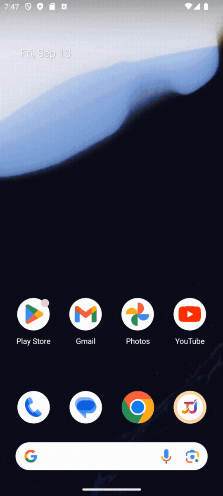
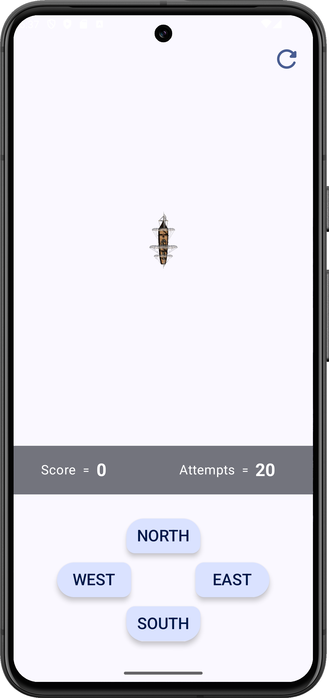
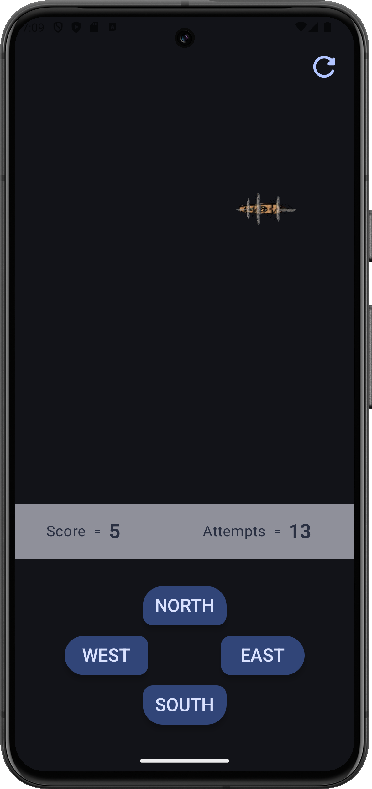

# Captain Ship Game 🚢 - Jetpack Compose

Welcome to **Captain Ship Game** This is an interactive and fun game where you control a ship navigating to various directions. The game features dynamic UI themes, follows MVVM architecture, and implements the Repository pattern to maintain clean code and separation of concerns.

## 📷 Preview

  

  
  

## 📱 Get Apk
[APK](Apk)

## 🔥 Features

- **Dynamic UI**

    The Captain Ship Game's UI interface and Theme adjusts dynamically to provide a responsive and user-friendly experience across various devices and screen sizes.

- **Game**
  
  1) We can move our ship into any direction NORTH⬆️ , EAST➡️ , WEST⬅️ & SOUTH⬇️ !
  
  2) We can have as many attempts we wish to have !

  3) We can keep the track of our Score !

  4) Unlimited number of chances/retries !
- **MVVM Architecture**
  - **Model** :
    Manages the data and business logic of the application.
   - **ViewModel** :
     Acts as a mediator between the View and the Model, handling the app's logic and preparing observable data for the View.
  - **View** :
    Displays data and captures user input, updating the UI based on the ViewModel's observable data.

- **Repository Pattern**

  Implements a clean and modular way to handle data operations, ensuring a separation of concerns and making the codebase more maintainable.

## 🏛️ Architecture
The architecture used in this project is [Android recommended architecture](https://developer.android.com/courses/pathways/android-architecture),
which I personally believe is a combination of some layers and principles of three architectures MVVM, MVI and Clean, which makes it great.

## 🚀 Jetpack Compose

* [Jetpack Compose](https://developer.android.com/jetpack/compose)
* [Jetpack Compose App](https://jetpackcompose.app/) -  Comparison of existing UI widgets and Jetpack Compose
* [Android Basics with Compose Course](https://developer.android.com/courses/android-basics-compose/course)
* [Compose performance Doc](https://developer.android.com/jetpack/compose/performance)
* [Jetpack Compose Component List](https://www.composables.com/components) – List of all components you can use in Jetpack Compose

## 📰 Updates
- 04 Aug, 2024 - **Released !**

## 🪪 License
[MIT Licence](LICENSE)